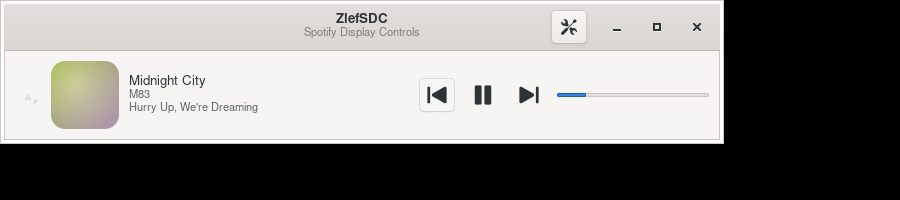

# ZlefSDC — Spotify Display Controls

A panel widget that shows the **current Spotify track** (cover · app icon · title ·
artist · album) with **transport controls** (◀ play/pause ▶), plus an optional
progress bar — and a *very* permissive settings surface so you control exactly
what renders and what every click/scroll does.

Despite the name it speaks plain **MPRIS2** over D-Bus, so it drives *any*
compliant player (Spotify by default, or `auto` to grab whatever is running).
No Spotify Web API, no tokens, no polling — it reacts to D-Bus property changes
in real time.

The first integration ships for **xfce4-panel**, but the entire product is one
reusable, desktop-environment-agnostic GTK widget (`libzlefsdc`); a new host
(GNOME, Waybar, Plasma, a bare window) is a ~60-line adapter.



## Architecture

```
core/        libzlefsdc — DE-agnostic, no panel deps
  settings   keyfile-backed property bag, emits "changed" (the permissive surface)
  player     MPRIS2/D-Bus backend: now-playing snapshot + controls, any player
  cover      async album-art loader + cache (file:// and http(s) artUrl)
  widget     ZlefsdcWidget — the whole UI as a single GtkWidget
  prefs      reusable settings notebook bound to the model
hosts/
  xfce        xfce4-panel plugin (the thin adapter)
  standalone  a bare GTK window hosting the widget (also the dev harness)
```

A host does only:

```c
ZlefsdcSettings *s = zlefsdc_settings_new (keyfile_path);
ZlefsdcWidget   *w = zlefsdc_widget_new (s);
zlefsdc_widget_set_orientation (w, orientation);   /* panel direction        */
zlefsdc_widget_set_panel_size  (w, thickness_px);  /* drives auto cover size  */
gtk_container_add (host_container, GTK_WIDGET (w));
```

The widget owns its player + cover loader and live-rebuilds on every settings
change, so adding a host needs **no new rendering code**.

## Settings (all live, all persisted)

- **Elements** — toggle cover, app icon, title, artist, album, prev, play/pause,
  next, progress independently.
- **Layout** — free element **order**, spacing, inline vs stacked title/artist,
  cover size (or fit-to-panel) and corner radius.
- **Text** — `%t/%a/%b` format strings, artist separator, idle placeholder,
  max characters with ellipsis or **marquee** scroll, custom font and colour.
- **Buttons** — icon size, symbolic icons, flat style.
- **Quick actions** — bind cover-click, title-click, middle-click, scroll-up and
  scroll-down each to: play/pause, next, previous, stop, raise the player, run a
  custom command, or nothing.
- **Player** — target `spotify`, `auto`, or any MPRIS bus name.

Fully internationalized — English (default) and French.

## Build & install

Requires GTK 3, GLib/GIO, and (for the panel plugin) `libxfce4panel-2.0` +
`libxfce4ui-2`.

```bash
meson setup build
ninja -C build
sudo ninja -C build install      # installs the plugin + standalone + locales
```

The xfce plugin is built only where its dev files are present; the core library
and standalone host build on any GTK desktop. To force it on/off:
`meson setup build -Dxfce=enabled` (or `disabled`).

After install, add it in Xfce: **Panel → Add New Items… → ZlefSDC**.

Run the standalone host anywhere:

```bash
build/hosts/standalone/zlefsdc-standalone [config.ini]
```

## Try it without Spotify

```bash
test/shoot.sh /tmp/out.png            # Xvfb + a mock MPRIS player + screenshot
```

`test/mock-mpris.py` owns `org.mpris.MediaPlayer2.spotify` with fake tracks, so
you can develop with no real player running.

## License

GPL-2.0-or-later. © zlef.fr
